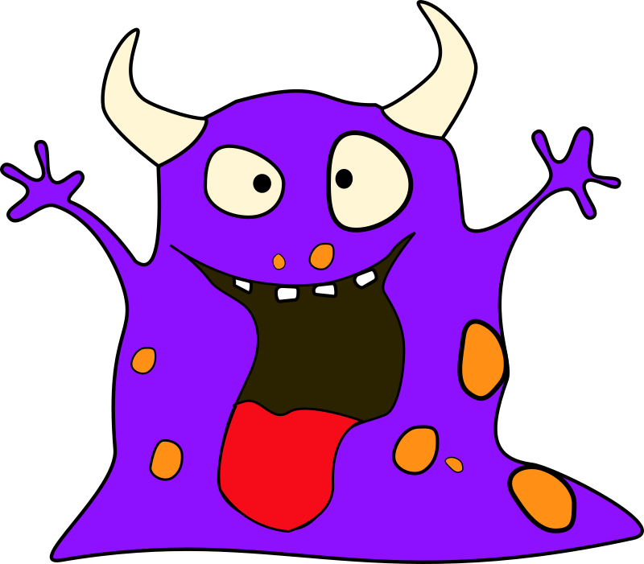

# FLTK

## Window

- [ ] Maintain Aspect Ratio (on/off)
- [ ] Widget Fill Mode (on/off)
    - [ ] (later) Actually respects proportions
- [ ] Background Color (set/unset)
- [ ] Background Image (add/remove)
- [ ] Can have overlay panel

## Panel

- [ ] Maintain Aspect Ratio (on/off)
- [ ] Widget Fill Mode (on/off)
- [ ] Background Color (set/unset)
- [ ] Background Image (add/remove)
- [ ] Can have overlay panel

## Grid

- [ ] Maintain Aspect Ratio (on/off)
- [ ] Background Color (set/unset)
- [ ] Background Image (add/remove)
- [ ] On Click
- [ ] On Hover
- [ ] Grid Lines (on/off) (color) (thickness)
- [ ] Cell Padding

## Grid Cell

- [ ] Background Color (set/unset)
- [ ] Background Image (add/remove)
- [ ] Style as Button or Flat
- [ ] On Click
- [ ] On Hover

## Tabs

- [ ] Hello world for Tabs!